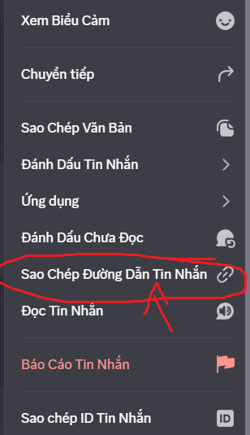

# Custom Status Discord


## Mô tả

Đây là một dự án Discord selfbot được viết bằng Node.js, cho phép bạn thiết lập trạng thái tùy chỉnh (custom status) và Rich Presence trên tài khoản Discord của mình. Bot sẽ tự động xoay vòng các trạng thái tùy chỉnh và cập nhật hình ảnh từ các tin nhắn Discord.

## Yêu cầu

- Node.js (phiên bản 14 trở lên)
- Tài khoản Discord
- Token Discord (lưu ý: sử dụng selfbot có thể vi phạm Điều khoản dịch vụ của Discord)

## Cài đặt

1. Clone repository này:
   ```
   git clone https://github.com/your-username/customeStatusDiscord.git
   cd customeStatusDiscord
   ```

2. Cài đặt các dependencies:
   ```
   npm install
   ```

3. Tạo file `.env` giống file .env.1




## Chạy

```
node main.js
```

Bot sẽ khởi động và bắt đầu cập nhật trạng thái Discord của bạn.

## Lưu ý

- Selfbot có thể vi phạm Điều khoản dịch vụ của Discord. Sử dụng tại rủi ro của bạn.
- Đảm bảo token Discord được bảo mật và không chia sẻ với người khác.
- Bot sẽ tự động restart sau mỗi 6 giờ để duy trì hoạt động.

## Giấy phép

ISC
